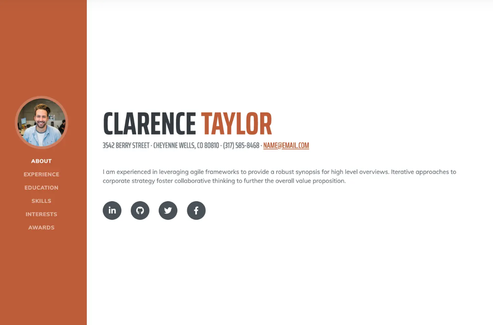

# Coverting templates to React App

This is a project which I created for practice purposes.
- I took the design from [StartBootStrap](https://startbootstrap.com/theme/resume)
- Then I converted it into a React App

Time Taken
- 1 hour

What I learnt in this project
- Breaking project elements and making the project modular

Deployed on Netlify
[**Netlify Link**]()